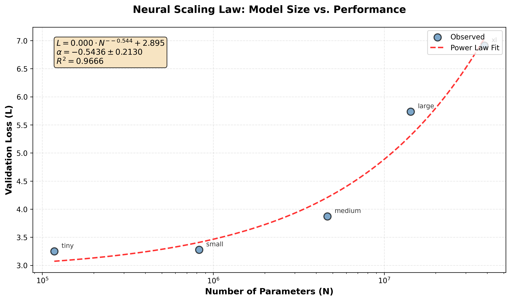
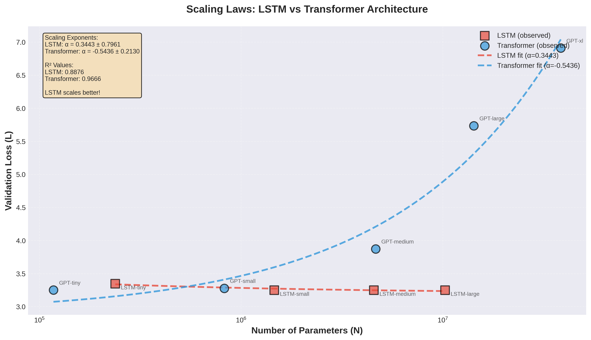

# Music Scaling Laws

An empirical study investigating scaling laws in Language Models for music generation, comparing GPT and LSTM architectures across different model sizes.

## Pipeline Overview

This project is organized as a 4-part pipeline:

### 1. Preprocessing Pipeline

**Notebook**: [Preprocessing Pipeline.ipynb](Preprocessing%20Pipeline.ipynb)

**Output**: `data/processed_music_data/`

Processes raw ABC notation music data and prepares it for training. Generates training, validation, and test splits along with vocabulary and statistics.

---

### 2. GPT Scaling and Visualisation

**Notebook**: [GPT Scaling and Visualisation.ipynb](GPT%20Scaling%20and%20Visualisation.ipynb)

**Output**: 
- `data/GPT_initial_training/` - Model checkpoints and training results for different GPT sizes (tiny, small, medium, large, xl)
- `data/GPT_analysis/` - Scaling law analysis and visualizations

Trains GPT models of varying sizes and analyzes their scaling behavior with respect to model parameters and computational resources.

---

### 3. LSTM Scaling and Comparison

**Notebook**: [LSTM Scaling and Comparison.ipynb](LSTM%20Scaling%20and%20Comparison.ipynb)

**Output**:
- `data/LSTM_training/` - Model checkpoints and training results for different LSTM sizes
- `data/comparison_analysis/` - Comparative analysis between GPT and LSTM architectures

Trains LSTM models across different sizes and performs a comprehensive comparison with GPT models.

---

### 4. Best Model Training and Sample Generation

**Notebook**: [Best Model Training and Sample Generation.ipynb](Best%20Model%20Training%20and%20Sample%20Generation.ipynb)

**Output**: `data/best_model/` - Fine-tuned model and generated music samples at various temperatures

Takes the best performing model and fine-tunes it further, then generates music samples to demonstrate the model's capabilities.